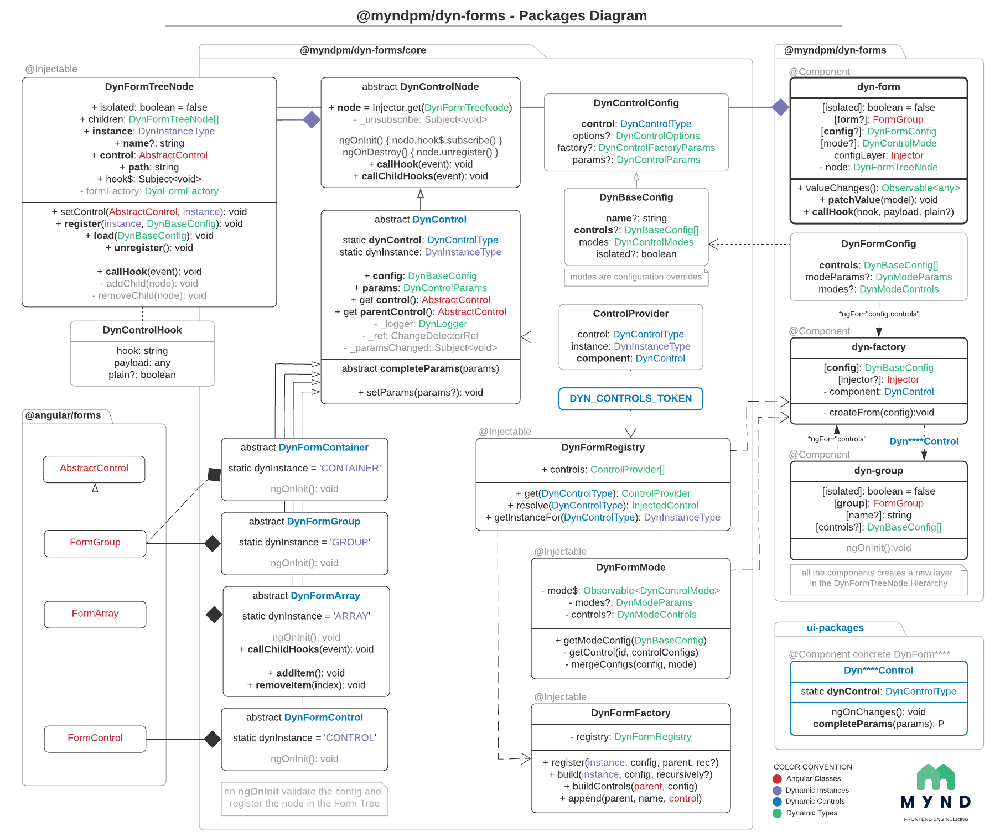

# Diagrama de tu Librería

Esta práctica pertenece al [Curso de Arquitectura del Software](https://escuela.it/cursos/curso-arquitecturas-software-agiles-pesadas) de EscuelaIT. 

La práctica consiste en diagramar el esquema del estilo arquitectónico que aplica cualquier framework que uses en tu día a día.

Se tiene que realizar el diagrama de clases y diagrama de secuencia que representen la arquitectura del framework que uses habitualmente.

Si estás haciendo el curso con las clases en vivo puedes juntarte con otros estudiantes para definir los diagramas del framework por grupos, si es que otros compañeros usan las mismas herramientas. En este caso puedes informar del framework que vas a utilizar y que otras personas lo sepan y puedan ponerse en contacto contigo para colaborar en la realización de esta práctica. https://msterdedesarr-bs88190.slack.com/archives/C01SX8T9J8L

En el repositorio puedes subir las imágenes generadas por la herramienta:

